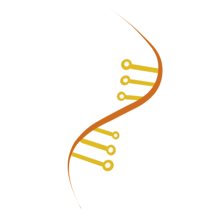

# MobsPy

Welcome to the Meta-species Oriented Biosystem Syntax in Python repository. MobsPy was invented to facilitate the design of complex Chemical Reaction Networks. In this repository, one can find the first implementation of this language and a simulation tool to simulate models generated by it. The simulation tool has both deterministic and stochastic compatibility.

# Python Version

MobsPy requires Python version 3.11 or higher.

# Getting started 

To get started, you only need to pip install:

	pip install mobspy 

And check out the [Read the Docs for MobsPy](https://mobspy-doc.readthedocs.io/en/latest/).
Tutorial notebooks and example models are available in the `docs/example_models/` directory.

# How it works

Meta-species are sets of species. Using them allows users to assign reactions to the entire set or a subset by querying. The Meta-species are based around a reaction inheritance system and independent state spaces.

## Basic syntax

To create species from scratch, use the `BaseSpecies` constructor that takes as an optional argument the number of species one wants to create. To assign rates, use the `>>` operator and `@` for the rate. To assign counts, use the call operator. An elementary example is the following:

	from mobspy import *

	A, B, C, D = BaseSpecies()
	A(200) + B(100) >> 2*C + D @ 420

	MySim = Simulation(A | B | C | D)
	MySim.run()

## Reversible Reactions

Reactions can be reversible by providing a tuple of (forward, reverse) rates:

	A(200) + B(100) >> 2*C + D @ (420, 10)

## Inheritance

For instance:

	Mortal = BaseSpecies()
	Mortal >> Zero @ 1

The reaction above is a death reaction where the meta-species Mortal is dying. `Zero` is the MobsPy variable for representing nothing. We can design new meta-species from other meta-species using either the multiplication or the `New()` constructor. 

	Replicator, Triplicator = New(Mortal, 2)
	Replicator >> 2*Replicator @ 1
	Triplicator  >> 3*Triplicator @ 1
	Multiplicator = Replicator*Triplicator 

In the code above, one can visualize the inheritance mechanism. Here both Replicator and Triplicator inherit from Mortal. Therefore, they also receive a death reaction. Multiplicator inherits from Replicator and Triplicator, and therefore from Mortal too. So Multiplicator now has three reactions, the death reaction, the duplication reaction, and the triplication reaction. 

## Independent State Spaces

Each meta-species has a set of states. One can add states to species by using the dot command (`.state`) or by inheritance. A meta-species that inherits from another gains access to its states. 
For instance:

	Horned, Color = BaseSpecies()
	Horned.small_horn >> Horned.big_horn @ 1
	Color.white >> Color.rainbow @ 1
	Unicorn = Horned*Color
	Unicorn.rainbow >> 2*Unicorn.white @ 1

Unicorn has the states of both Horned and color in the code above and their reactions. Unicorn species will be formed by the name followed by a dot and a state for each species inheritors for all possible combinations. So here we have the species - `Unicorn.small_horn.white`, `Unicorn.big_horn.white`, `Unicorn.small_horn.rainbow`, `Unicorn.big_horn.rainbow`. 

The states can be used in the reactants to assign a reaction only to the correct subset. Here only the rainbow unicorns can duplicate. Finally, the states on the products refer to transformations of states that originate from the same meta-species. So here, all the rainbow Unicorns become white after multiplying since both states come from the meta-species color. 

# Simulation

Just use the Simulation constructor and the run command to execute a simulation. The Simulation command must receive all the meta-species the user wants to simulate as an argument. For the unicorn example, one could code:

	MySim = Simulation(Unicorn)
	MySim.run()

# Parameter definition

The parameters are defined using the dot notation on the simulation object. For standard parameters, use the dot notation directly, and for plotting parameters, use the `.plot_config.parameter` notation.
See [here for a list of parameters](https://github.com/ROBACON/mobspy/blob/main/mobspy/parameters/README.md).
Standard parameters can also be configured using a JSON file with the `.set_from_json` method. As an example, we have the code below:

	MySim.save_data = False
	MySim.plot_data = False
	MySim.duration = 100
	MySim.repetitions = 10
	MySim.plot_config.xlim = [0,1]
	MySim.plot_config.ylim = [0, 1e3]

For a full list of parameters, see the [parameters README](https://github.com/ROBACON/mobspy/blob/main/mobspy/parameters/README.md).

# Units
	
The variable u from the pint Python module for unit handling is used to assign units to values in MobsPy. Just add `u.name_of_the_unit`, and MobsPy will handle it. As a code example, we have:

	A(100*u.molar)
	A >> Zero @ (10 / u.nanosecond)

# Compiling

Before simulating, you might want to use the compile method from the Simulation class. The compile function prints all the species, mappings (meta-species and species relation), parameters, and reactions. Thus, allowing one to check their model before simulation and executing. 

# Calculations

MobsPy generates an SBML string for each model. The SBML string is passed to basiCO (COPASI in Python), and they handle the calculations. MobsPy returns the data to the user in the Simulation object and a JSON file.

For the rates, MobsPy considers mass action kinetics as default. For different, more complex rates, one can use strings.

# Compatibility

MobsPy supports defining and compiling models from multiple threads concurrently. Each thread gets isolated DSL state via `ContextVar`. However, do not share a single `Simulation` instance across threads.

# API Stability

MobsPy follows [Semantic Versioning](https://semver.org/). The public API is
everything exported from `mobspy.__init__` (listed in `__all__`):

- **Patch** releases (2.8.x) contain bug fixes only.
- **Minor** releases (2.x.0) may add new features but will not break existing
  code.
- **Major** releases (x.0.0) may contain breaking changes. These will be
  documented in the changelog with migration instructions.

Experimental features (such as ODE syntax) are explicitly marked and may change
in any release.

See [CHANGELOG.md](CHANGELOG.md) for the full release history.

